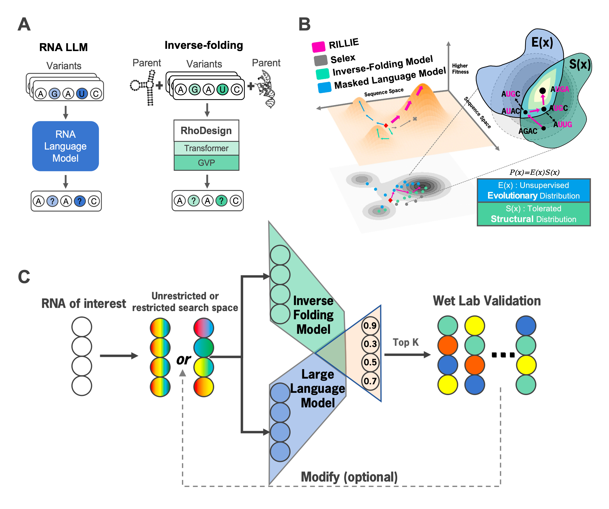
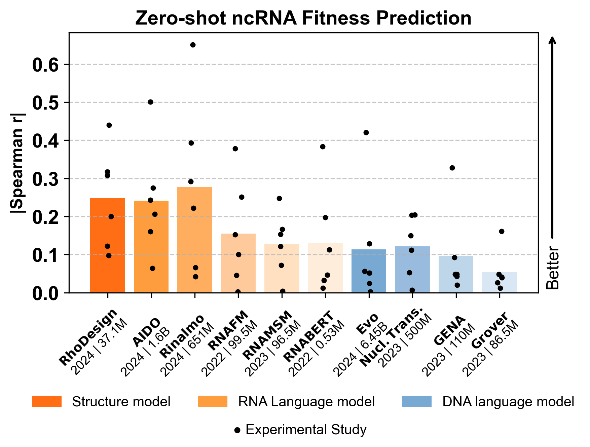
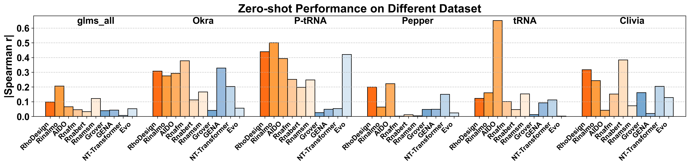
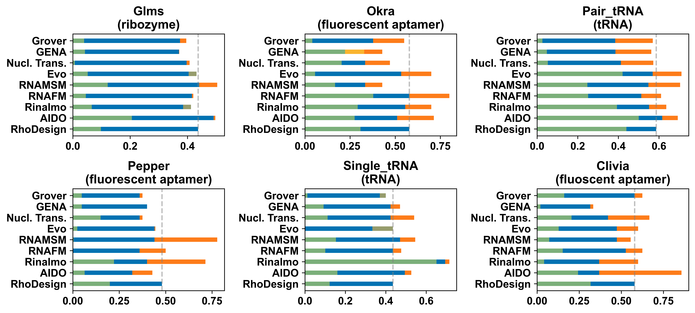
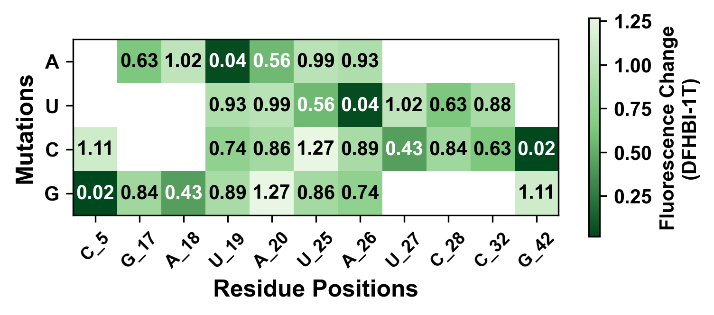
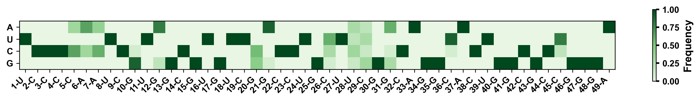

# RILLIE: RNA In Silico Evolution via LLM and Inverse folding
✨ Welcome to the official repository for "RILLIE: RNA In Silico Evolution via LLM and Inverse folding". 

-- 🔗 Read our paper: [ArXiv](https://arxiv.org/abs/****.*****) --

## Overview

🚀 We introduce RILLIE, a general RNA foundation model that integrate sequence and structure information to evolve RNA in a zero-shot fashion. RILLIE integrating a large language model with an inverse folding model can generate functional RNA sequences aligning with natural evolutionary patterns at the sequence level while preserving the structural integrity of key functional regions. Using RILLIE, we successfully evolved two engineered RNA aptamers, Broccoli and Pepper, with a high success rate, low sequence similarity, improved binding affinity and fluorescence in live cell.



## 🗂 Contents

- [Installation](#installation)
- [Benchmark](#Benchmark)
  - [Dataset Description](#dataset-description)
  - [Model Description](#model-description)
  - [Generate RNA Structure](#generate-rna-structure)
  - [Zero-shot ncRNA fitness prediction](#data-processing)
  - [High-fitness sensitivity analysis](#data-processing)
- [Using RILLIE](#using-RILLIE)
  - [CheckPoints](#checkpoints)
  - [General RNA Evolution](#general-rna-evolution)
  - [Multi-Round Evolution (Optional)](#multi-round-evolution-(Optional))
<!-- - [Citation](#citation) -->
- [Acknowledgements](#acknowledgements)

## Installation
### If you prefer a faster setup, you can use the provided RILLIE.yaml file:
```bash

conda env create -f RILLIE.yaml -y
conda activate RILLIE

```

### You can also install the environment either by following the step-by-step instructions below.
```bash
# Create a conda environment
conda create -y -n RILLIE python=3.10
conda activate RILLIE

# Install PyTorch and CUDA dependencies
pip install torch==2.1.0+cu121 torchvision==0.16.0+cu121 torchaudio==2.1.0+cu121

# Install PyTorch Geometric and related dependencies
pip install torch-geometric==2.6.1 torch-scatter==2.1.2+pt21cu121

# Install Bioinformatics and Structural Biology packages
pip install \
    biopython==1.84 \
    bio==1.7.1 \
    biothings-client==0.3.1 \
    biotite==1.1.0 \
    biotraj==1.2.2 \
    mygene==3.2.2 \
    prody==2.4.1 \
    pymatgen==2024.8.9 \
    spglib==2.5.0 \
    openmm==8.1.1 \
    simtk==0.1.0 \
    rdkit-pypi==2021.3.4 

# Install Machine Learning and Deep Learning dependencies
pip install \
    scikit-learn==1.6.0 \
    torchdrug==0.2.1 \
    transformers==4.47.0 \
    pytorch-lightning==2.4.0 \
    lightning==2.4.0 \
    torchmetrics==1.6.0 \
    peft==0.14.0

# Install Data Processing and Computation Libraries
pip install \
    numpy==1.26.3 \
    scipy==1.14.1 \
    pandas==2.2.2 \
    numba==0.60.0 \
    sympy==1.12 \
    tqdm==4.66.5 \
    joblib==1.4.2 \
    threadpoolctl==3.5.0 

# Install Visualization Tools
pip install \
    matplotlib==3.9.2 \
    seaborn==0.13.2 \
    plotly==5.23.0 \
    bokeh==3.6.2 \
    datashader==0.16.3 \
    holoviews==1.20.0 

# Install Web & API Utilities
pip install \
    requests==2.32.3 \
    aiohttp==3.11.10 \
    huggingface-hub==0.26.5 \
    pyyaml==6.0.2 \
    urllib3==1.26.13 

# Install Miscellaneous Tools
pip install \
    rna-fm==0.2.2 \
    ml-collections==0.1.1 \
    uncertainties==3.2.2 \
    markdown==3.7 \
    jsonargparse==4.34.1
```

<!--```bash
if you have problem like this error information: ImportError: cannot import name 'packaging' from 'pkg_resources' (/xcfhome/ypxia/anaconda3/envs/gernabind/lib/python3.8/site-packages/pkg_resources/__init__.py) with torchdrug, you can try this command below:
pip install --upgrade packaging
pip install --upgrade pip setuptools
```
-->

## Benchmark
### Dataset Description
We collected 6 ncRNA DMS datasets including tRNA, RNA aptamer and ribozyme from previous papers or private data:
- tRNA datasets:
  
   [Pair-tRNA](https://www.nature.com/articles/s41586-018-0170-7)

   [tRNA](http://genesdev.cshlp.org/lookup/doi/10.1101/gad.245936.114)
- RNA aptamer datasets:

   [Pepper](https://www.nature.com/articles/s41587-019-0249-1)

   [Clivia](https://www.nature.com/articles/s41592-023-01997-7)

    [Okra](https://www.nature.com/articles/s41589-024-01629-x)
- ribozyme datasets:

   [Glms](https://www.nature.com/articles/s41467-020-15540-1)
### Model Description
Our benchmark includes following models:
- RNA language models:

  [AIDO.RNA(1.6B)](https://github.com/genbio-ai/AIDO)

  [RiNALMo](https://github.com/lbcb-sci/RiNALMo)

  [RNAFM](https://github.com/ml4bio/RNA-FM)

  [RNAMSM](https://pmc.ncbi.nlm.nih.gov/articles/PMC9477273/)

- DNA language models:

  [Evo 1](https://hariboss.pasteur.cloud/)

  [Nucleotide Transformer](https://hariboss.pasteur.cloud/)

  [Grover](https://hariboss.pasteur.cloud/)

  [GENA](https://hariboss.pasteur.cloud/)

- RNA inverse-folding models:
  
  [RhoDesign](https://github.com/ml4bio/RhoDesign)

### Generate RNA Structure
We use [RhoFold](https://github.com/ml4bio/RhoFold) and [AlphaFold3](https://github.com/google-deepmind/alphafold3) to generate RNA 3D Structure 

We use [Chai](https://github.com/chaidiscovery/chai-lab) to generate RNA 2D structure (as the input of RILLIE).


### Zero-shot ncRNA fitness prediction
The average spearman and pearson correlations across 6 datasets can be visualized through following command:
```bash
python ./RILLIE/utils/ncRNA_fitness_prediction_average.py
```
Spearman corelations are visualized as follows:



The specific spearman and pearson correlations across 6 datasets can be visualized through following command:
```bash
python ./RILLIE/utils/ncRNA_fitness_prediction_all.py
```
Spearman corelations are visualized as follows:

<div style="width:1000px; height:300px; overflow:hidden;">

</div>

### High-fitness sensitivity analysis
```bash
python ./RILLIE/utils/ncRNA_fitness_prediction_all.py
```
Spearman corelations are visualized as follows:



<!--### Dataset Download
 You can download the benchmark data from [Zenodo](https://zenodo.org/records/14808549).-->

## Using RILLIE

### CheckPoints
You can download the model checkpoint from [Google Drive link](https://drive.google.com/drive/folders/1H3Itu6TTfaVErPH50Ly7rmQDxElH3JEz?usp=sharing).

Then, place the downloaded data into the `./RILLIE/model/IFM/checkpoint` directory.

### General RNA Evolution

#### 1、generate the secondary and tertiary structures of RNA to be evolved

secondary structure (.npy) can be generated by [RhoFold](https://github.com/ml4bio/RhoFold) or [Chai](https://lab.chaidiscovery.com/auth/login?callbackUrl=https%3A%2F%2Flab.chaidiscovery.com%2Fdashboard)

tertiary structure can be generated(.pdb) by [Chai](https://lab.chaidiscovery.com/auth/login?callbackUrl=https%3A%2F%2Flab.chaidiscovery.com%2Fdashboard) or [AlphaFold3](https://alphafoldserver.com) or [RhoFold](https://github.com/ml4bio/RhoFold)

#### 2、Place .pdb file into the `./RILLIE/model/IFM/data/test` directory 
#### Place .npy file into the `./RILLIE/model/IFM/data/test_ss` directory

Tips: .pdb file and .npy file should have the same name

Example: test_1.pdb and test_1.npy
#### 3、Score the sequence lod-likelihood and pick out top X% sequences using following command:

```bash
python ./RILLIE/model/IFModel/src/score_sequence_joint_likelihood.py
```

Example Output:

```bash
Processing pdb files for sequence: 100%|███████████████████████████████████████████████████████████████████████████| 1/1 [00:00<00:00, 27.23it/s]
Sequence Sequence_63: IFM score = -3.0081936583227042, LLM score = -1.1260515451431274
Scoring sequence Sequence_64...
Processing pdb files for sequence: 100%|███████████████████████████████████████████████████████████████████████████| 1/1 [00:00<00:00, 26.98it/s]
Sequence Sequence_64: IFM score = -2.9159689144212373, LLM score = -1.0990711450576782
Threshold for IFM (top 10.0%): -2.946614666374362
Threshold for LLM (top 10.0%): -1.0952333569526673
Selected 2 sequences out of 64.
```

### Multi-Round Evolution (Optional)
Based on the wet-lab testing results, we can discarding harmful mutations to increase the success rate, while introducing new mutations to help direct evolution escape local optima and discover global optima.  This approach enables efficient directed evolution without retraining the model and is specially useful when the tested variants are very few.
#### 1、Visualize Fitness Heatmap(such as Fluorescence or Affinity) based on the previous wet-lab testing results
```bash
python ./RILLIE/utils/wet_data_analysis.py
```

Spearman corelations are visualized as follows:



#### 2、Discard harmful mutations to increase the success rate
The mutations in dark color indicates harmful mutations.

#### 3、Introduce new mutations and visualize the mutational distribution

```bash
python ./RILLIE/utils/visualize_mutational_distribution.py
```
Mutational distribution(e.g. broccoli) is visualized as follows:



#### 4、Score the sequence lod-likelihood and pick out top X% sequences using following command:
```bash
python ./RILLIE/model/IFModel/src/score_sequence_joint_likelihood.py
```


## License
No Commercial use of either the model nor generated data, details to be found in license.md.

<!-- ## Citation
🤗 If you find our code useful or our work relevant, please consider citing:

```
@article{gerna2025,
  title={GerNA-Bind: Geometric-informed RNA-ligand Binding Specificity Prediction with Deep Learning},
  author={Yunpeng Xia, Jiayi Li, Jiahua Rao, Dong-Jun Yu, Xiucai Chen and Shuangjia Zheng},
  journal={arXiv preprint arXiv:****.*****},
  year={2025}
}
``` -->

## Acknowledgements

Our work builds upon [AIDO.RNA(1.6B)](https://github.com/genbio-ai/AIDO),[RiNALMo](https://github.com/lbcb-sci/RiNALMo),[RNAFM](https://github.com/ml4bio/RNA-FM),[RNAMSM](https://pmc.ncbi.nlm.nih.gov/articles/PMC9477273/),[Evo 1](https://hariboss.pasteur.cloud/),[Nucleotide Transformer](https://hariboss.pasteur.cloud/),[Grover](https://hariboss.pasteur.cloud/),[GENA](https://hariboss.pasteur.cloud/) ,[RhoDesign](https://github.com/ml4bio/RhoDesign),[RhoFold](https://github.com/ml4bio/RhoFold)Thanks for their excellent work and open-source contributions.
